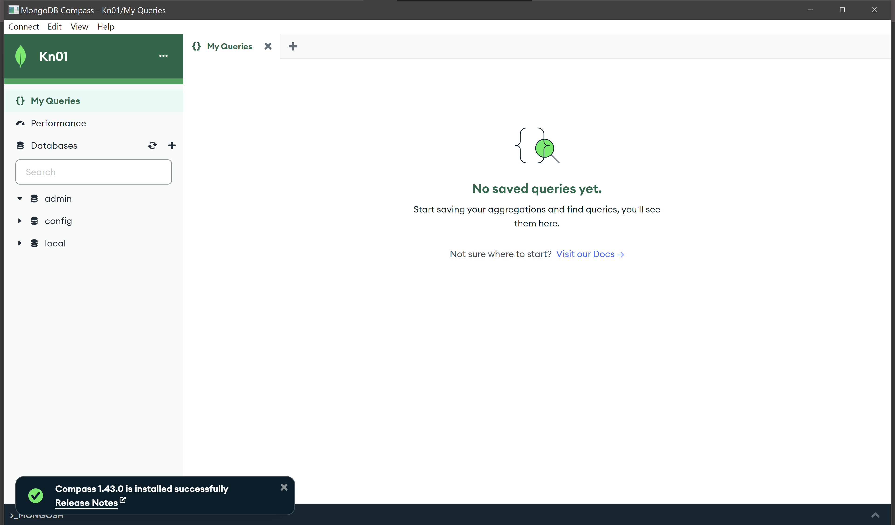
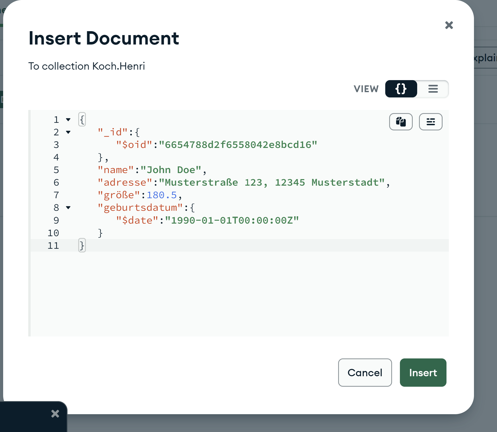
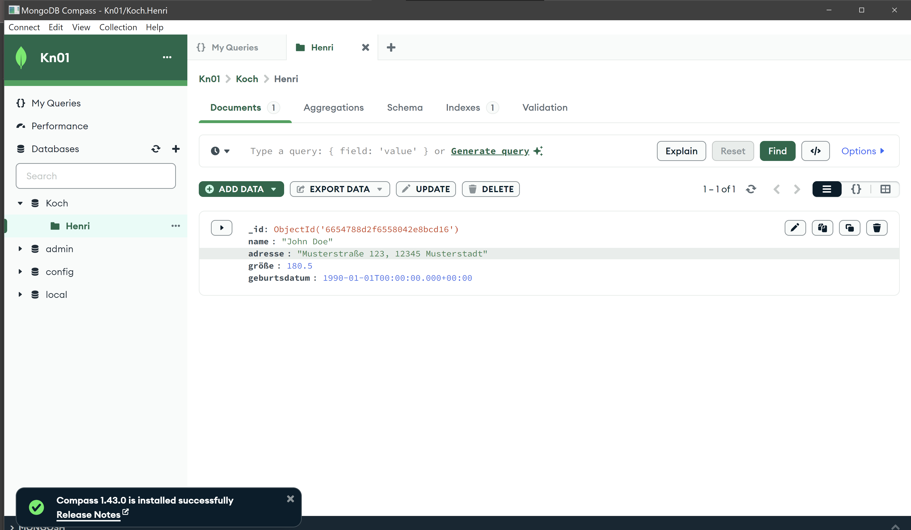
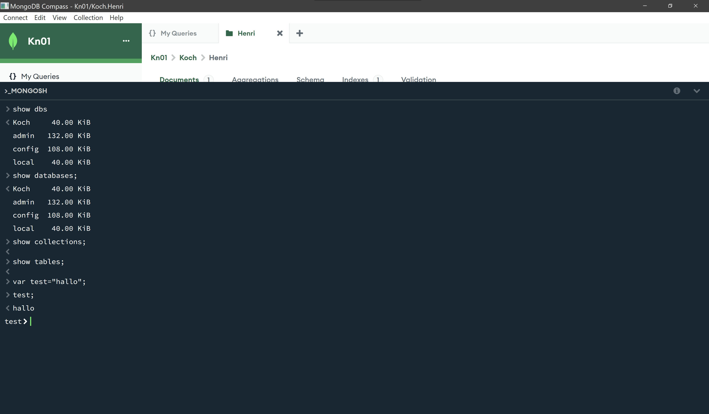
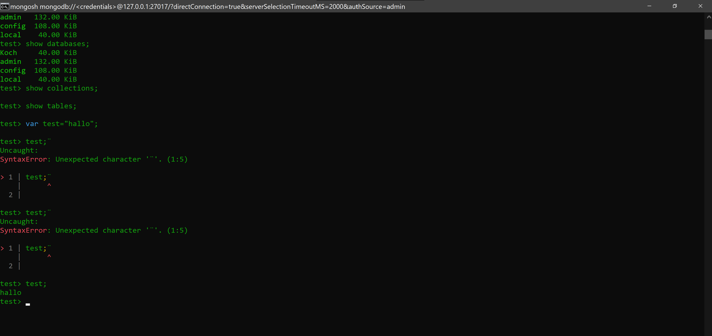

# A



Es sagt aus bei welcher Datenbank es sich authentifizieren soll. In dem Fall ist es die Admin Database.

"Specify the database name associated with the user's credentials. If authSource is unspecified, authSource defaults to the defaultauthdb specified in the connection string. If defaultauthdb is unspecified, then authSource defaults to admin."

'sudo sed -i 's/127.0.0.1/0.0.0.0/g':  alle Netzwerkschnittstellen für eingehende Verbindungen öffnen.
'sudo sed -i 's/#security:/security:\n authorization: enabled/g' /etc/mongod.conf': Aktiviert die authorization sodass man sich nun beime zugriff anmelden muss.

# B



```
[{
  "_id": {
    "$oid": "6654788d2f6558042e8bcd16"
  },
  "name": "John Doe",
  "adresse": "Musterstraße 123, 12345 Musterstadt",
  "größe": 180.5,
  "geburtsdatum": {
    "$date": "1990-01-01T00:00:00.000Z"
  }
}]
```
Es könnte Probleme geben wenn man das Datum als String an gibt.

# C




Sie zeigen was es für Dtaenbanken, Collections und Tables gibt.
