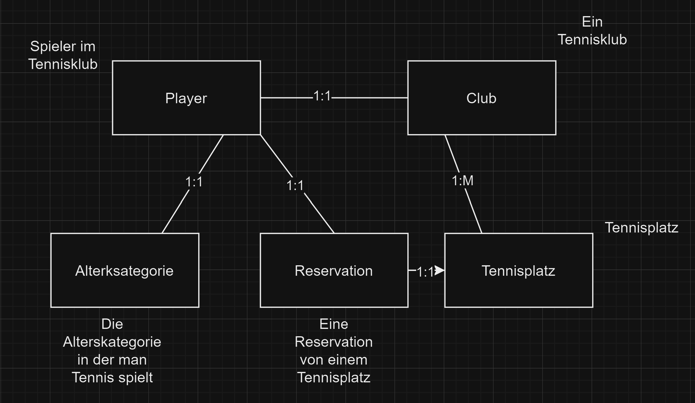

Ich habe die Verschachtelung so geweahlt weil es Sinn macht das die Tennispleatze Beim Club abgespeichert werden da sie ja auch zu ihm gehoeren.

```
// Switch to the database
use TennisClubDB;

// Create the 'Players' collection
db.createCollection("Players", {
    validator: {
        $jsonSchema: {
            bsonType: "object",
            required: ["Name", "Alter", "Rank", "Alterskategorie"],
            properties: {
                Name: {
                    bsonType: "string",
                    description: "must be a string and is required"
                },
                Alter: {
                    bsonType: "int",
                    description: "must be an integer and is required"
                },
                Rank: {
                    bsonType: "string",
                    description: "must be a string and is required"
                },
                Alterskategorie: {
                    bsonType: "objectId",
                    description: "must be an ObjectId and is required"
                },
                Reservation: {
                    bsonType: "array",
                    items: {
                        bsonType: "objectId"
                    },
                    description: "must be an array of ObjectIds"
                }
            }
        }
    }
});

// Create the 'Alterskategorie' collection
db.createCollection("Alterskategorie", {
    validator: {
        $jsonSchema: {
            bsonType: "object",
            required: ["Name", "Mindest alter"],
            properties: {
                Name: {
                    bsonType: "string",
                    description: "must be a string and is required"
                },
                "Mindest alter": {
                    bsonType: "int",
                    description: "must be an integer and is required"
                },
                Player: {
                    bsonType: "array",
                    items: {
                        bsonType: "objectId"
                    },
                    description: "must be an array of ObjectIds"
                }
            }
        }
    }
});

// Create the 'Reservations' collection
db.createCollection("Reservations", {
    validator: {
        $jsonSchema: {
            bsonType: "object",
            required: ["Player", "Tennisplatz"],
            properties: {
                Player: {
                    bsonType: "objectId",
                    description: "must be an ObjectId and is required"
                },
                Tennisplatz: {
                    bsonType: "objectId",
                    description: "must be an ObjectId and is required"
                }
            }
        }
    }
});

// Create the 'Tennisplätze' collection
db.createCollection("Tennisplätze", {
    validator: {
        $jsonSchema: {
            bsonType: "object",
            required: ["Id"],
            properties: {
                Id: {
                    bsonType: "int",
                    description: "must be an integer and is required"
                },
                Reservation: {
                    bsonType: "objectId",
                    description: "must be an ObjectId"
                }
            }
        }
    }
});

// Create the 'Clubs' collection
db.createCollection("Clubs", {
    validator: {
        $jsonSchema: {
            bsonType: "object",
            required: ["Name"],
            properties: {
                Name: {
                    bsonType: "string",
                    description: "must be a string and is required"
                },
                Players: {
                    bsonType: "array",
                    items: {
                        bsonType: "objectId"
                    },
                    description: "must be an array of ObjectIds"
                },
                Tennisplätze: {
                    bsonType: "array",
                    items: {
                        bsonType: "objectId"
                    },
                    description: "must be an array of ObjectIds"
                }
            }
        }
    }
});

```
