# A
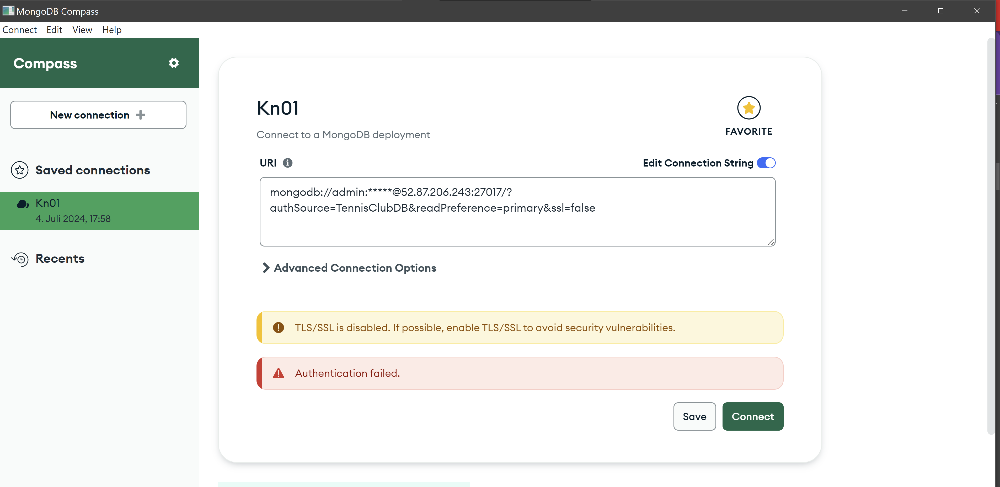

```
use TennisCLubDB

db.createUser({
    user: 'Koch',
    pwd: '1234',
    roles: [
        {role: "read", db: "TennisClubDB"}
    ]
})
db.createUser({
    user: 'Henri',
    pwd: '1234',
    roles: [
        {role: 'readWrite', db: 'TennisClubDB'}
    ]
})

```
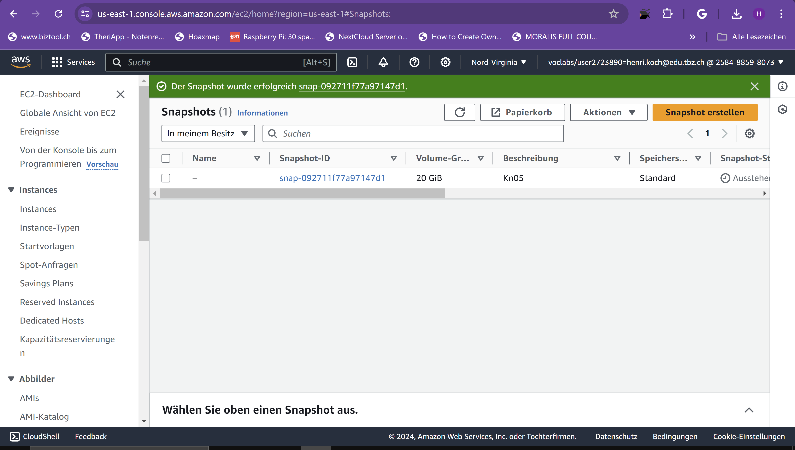
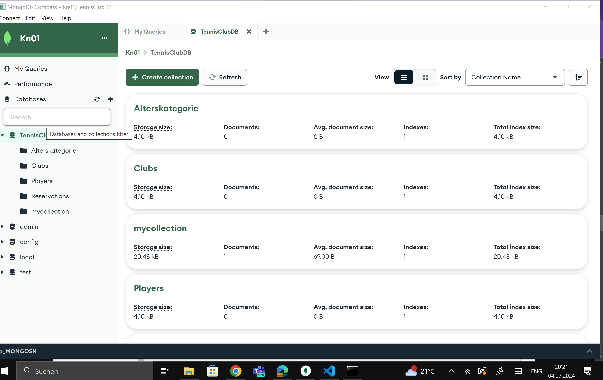
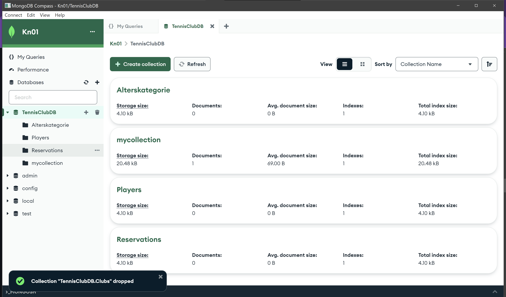
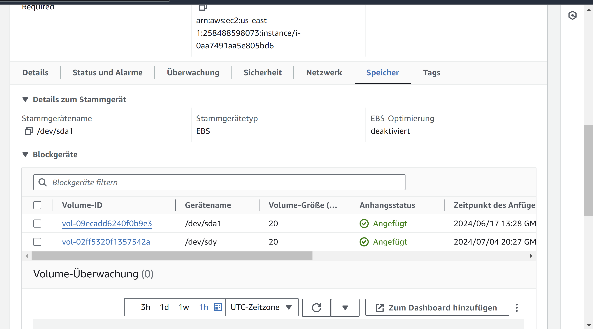
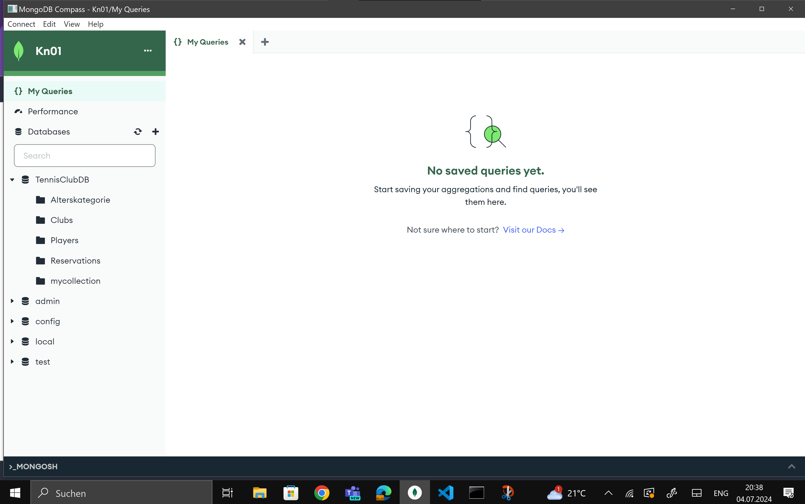

# B

### 1

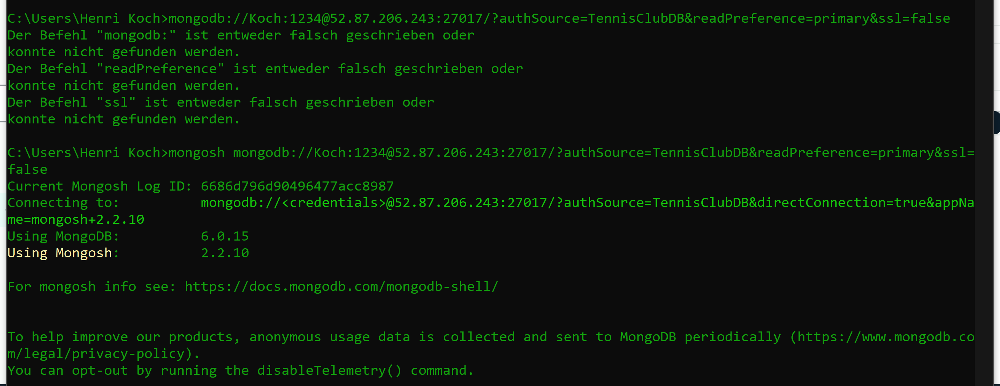
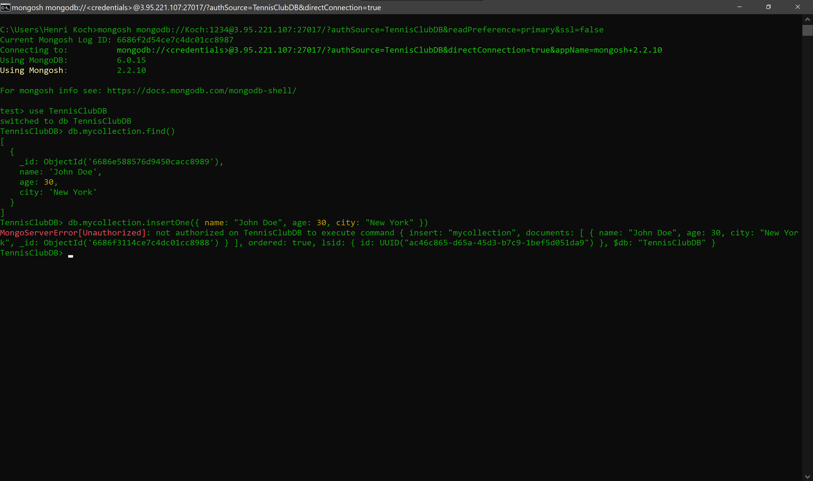
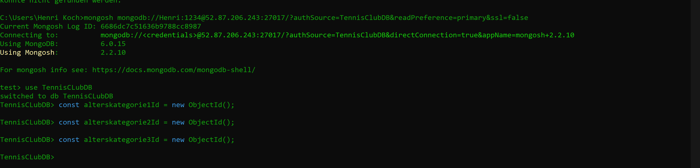
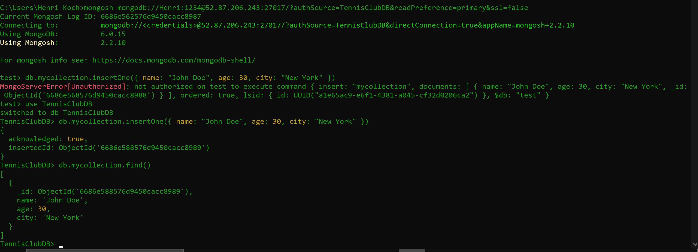


Ich habe das alte volumen getrennt und aus dem snapshot ein Volumen gemacht und dann angeheangt.

### 2

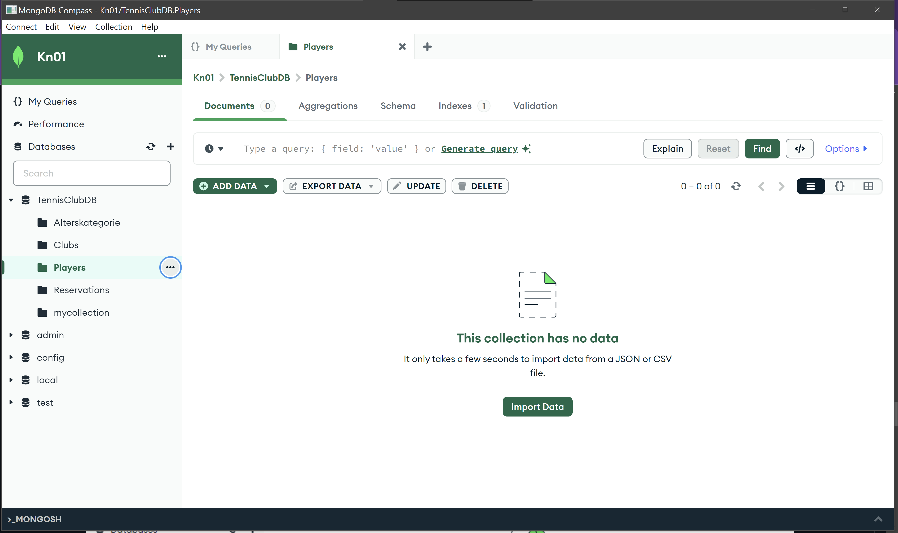
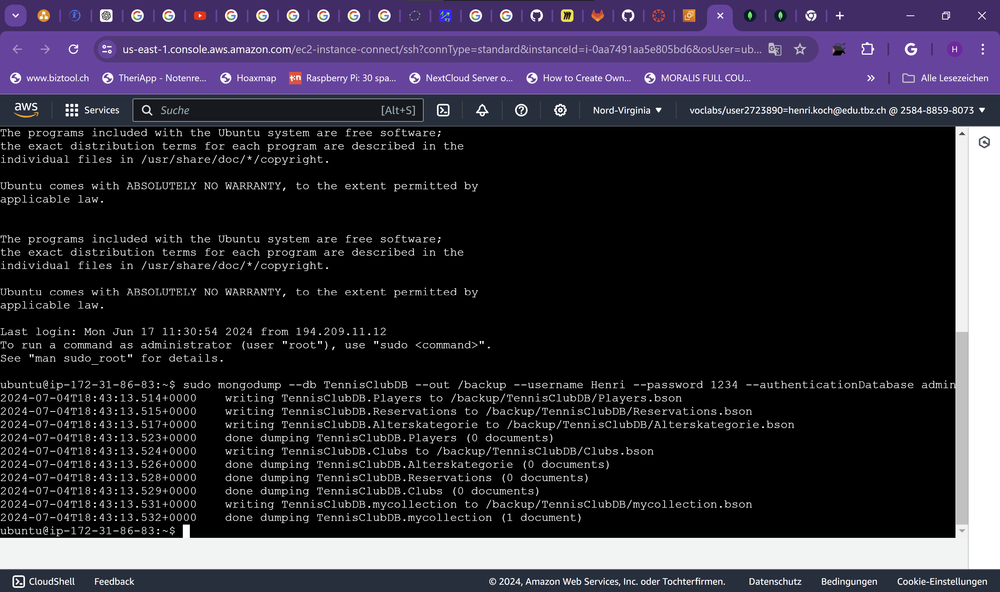
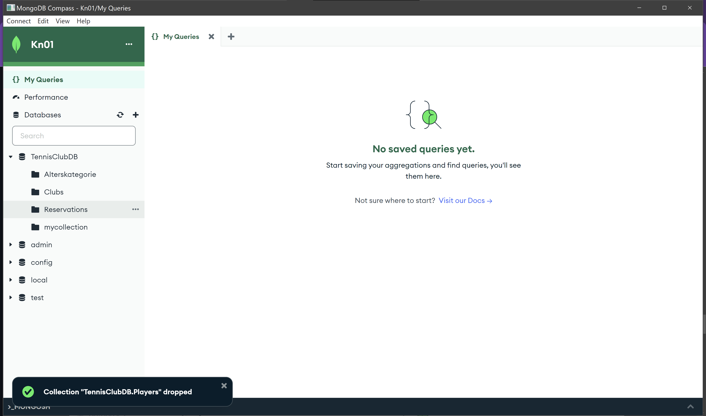
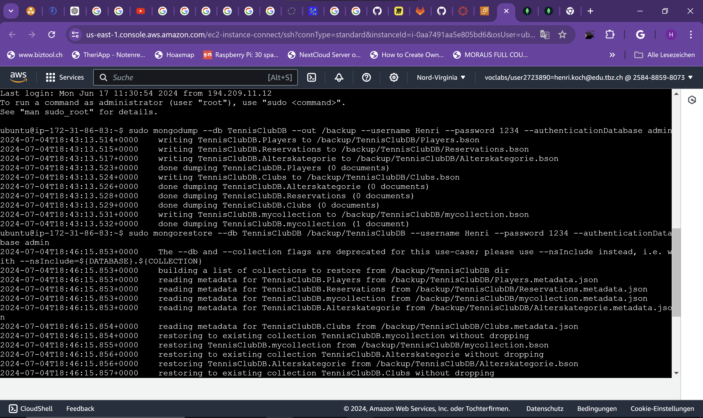
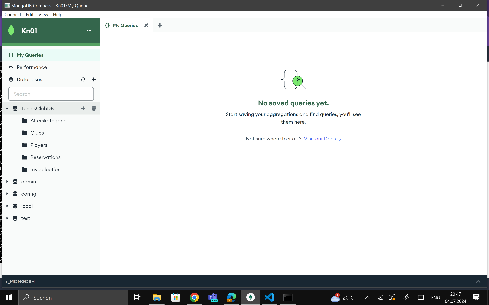


# C
### Replication
Dabei wird die gesamte Datenbank auf mehreren Servern gespiegelt, sodass bei Ausfall eines Servers die Daten noch von anderen Servern abgerufen werden können. Meistens gibt es einen Master Server und dann die Slave Server die die Daten speigeln.

### Sharding
Sharding  ist eine Methode zur Skalierung von Datenbanken, bei der der gesamte Datenbestand horizontal auf mehrere unabhängige Datenbankinstanzen (Shards) aufgeteilt wird. Wir der Name schon sagt werden die Daten wie Splitter aufgeteilt auf mehreren servern.

