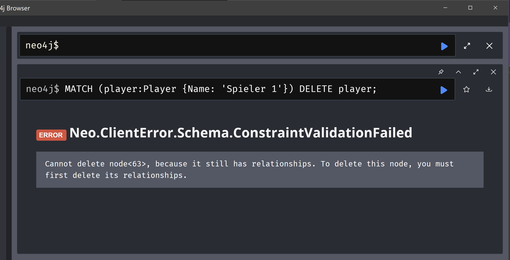

# A
[txt](A.txt)

# B

Szenario 1: Wir möchten alle Spieler finden, die in einem bestimmten Club sind, und die Alterskategorien dieser Spieler abrufen.
```
MATCH (club:Club {ClubId: 1})<-[:IS_IN_CLUB]-(player:Player)
OPTIONAL MATCH (player)-[:IS_IN]->(alterskategorie:Alterskategorie)
RETURN player.Name, player.Alter, player.Rank, alterskategorie.AlterskategorieId;
```

Szenario 2: Wir möchten alle Reservierungen von Spielern abrufen, die zu einer bestimmten Alterskategorie gehören, und die Details der Tennisplätze, die reserviert wurden.
```
MATCH (alterskategorie:Alterskategorie {AlterskategorieId: 1})<-[:IS_IN]-(player:Player)
OPTIONAL MATCH (player)-[:CAN_MAKE]->(reservation:Reservation)-[:RESERVATE]->(tennisplatz:Tennisplatz)
RETURN player.Name, reservation.ReservationDate, tennisplatz.TennisplatzId;
```

Szenario 3: Wir möchten alle Spieler finden, die mehr als eine Reservierung gemacht haben, und die Details dieser Reservierungen anzeigen.
```
MATCH (player:Player)-[:CAN_MAKE]->(reservation:Reservation)
WITH player, COUNT(reservation) AS reservationCount
WHERE reservationCount > 1
RETURN player.Name, reservationCount;
```

Szenario 4: Wir möchten alle Clubs finden, die derzeit keine Spieler haben.
```
MATCH (club:Club)
WHERE NOT EXISTS { MATCH (club)<-[:IS_IN_CLUB]-(:Player) }
RETURN club.ClubId;
```

# C

Ohne detach
```
MATCH (player:Player {Name: 'Spieler 1'})
DELETE player;
```
mit detach
```
MATCH (player:Player {Name: 'Spieler 2'})
DETACH DELETE player;
```


I tried to delete a node but it doesnt work because it still has relations which dont get deleted with this statement.


It worked becuase with detacha u also delete all the relation which this node has to other nodes.

# D

Szenario 1: Der Tennisplatz mit TennisplatzId 4 im Club 4 soll umbenannt werden.
```
MATCH (club:Club {ClubId: 4})-[:BELONGS_TO]->(tennisplatz:Tennisplatz {TennisplatzId: 4})
SET tennisplatz.TennisplatzName = "Neuer Tennisplatzname"
RETURN tennisplatz
```
Szenario 2: Charlie wird ein Jahr älter, sein Alter soll im System aktualisiert werden.
```
MATCH (charlie:Player {Name: "Charlie"})
SET charlie.Alter = charlie.Alter + 1
RETURN charlie
```
Szenario 3: Alice, die Spielerin mit ClubId 1, wechselt vom aktuellen Club zu Club 3.
```
MATCH (alice:Player {Name: "Alice"})-[oldRel:IS_IN_CLUB]->(currentClub:Club {ClubId: 1})
MATCH (newClub:Club {ClubId: 3})
DELETE oldRel
MERGE (alice)-[:IS_IN_CLUB]->(newClub)
RETURN alice, newClub
```

# E

### Case Klausel

Mit der case Klausel koennen wir Logik in einem Cypher-Statement implementieren.
Je nach dem was fuer bedingungen erfuellt werden koennen dann verschiedene Sachen ausgefuehrt werden.
bsp.

wir möchten basierend auf dem Alter eines Spielers verschiedene Alterskategorien zuweisen und aktualisieren
```
MATCH (player:Player)
SET player.AlterskategorieId = 
  CASE 
    WHEN player.Alter <= 25 THEN 1
    WHEN player.Alter > 25 AND player.Alter <= 30 THEN 2
    WHEN player.Alter > 30 THEN 3
    ELSE null
  END
RETURN player

```

### Unwind

Mit der Klausel koennen wir Listen entfalten und jedes item der Liste als einzelnes Objekt behandeln.

bsp.
wir möchten für jeden Spieler in unserer Datenbank eine neue Reservierung für einen Tennisplatz erstellen.
Wir haben eine Liste von Spielern und möchten diese Liste entfalten, um für jeden Spieler eine Reservierung zu erstellen.

```
MATCH (player:Player)
WITH player
UNWIND [date("2024-07-06"), date("2024-07-07"), date("2024-07-08")] AS reservationDate
MERGE (player)-[:CAN_MAKE]->(r:Reservation {TennisplatzId: player.ClubId, ReservationDate: reservationDate})
RETURN player, r
```
